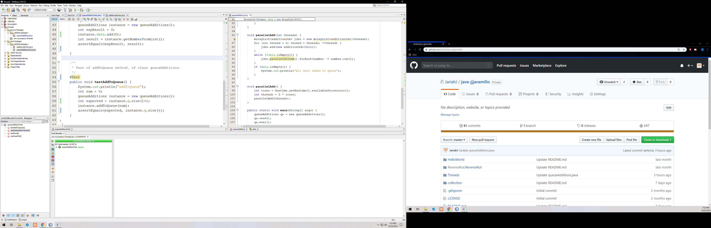
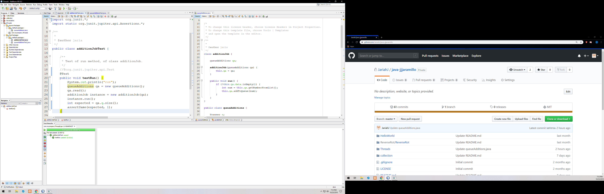

The program that I wrote utilizing threads initially reads 5k random numbers ranging from 1-100 into a text file named "input.txt" and store them into an arrayList. Utilizing threads, I am able to read from the arrayList and insert them into a queue. Reading from the list and inserting into the queue are each synchronized with their own corresponding locks.

