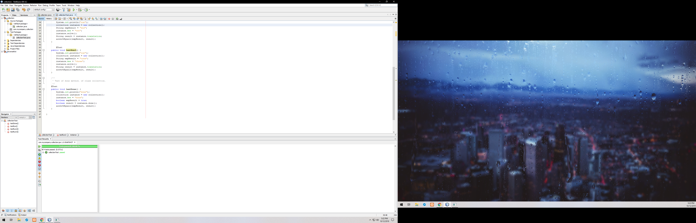

The Collections assignment that I created was a HashMap which would ask the user to enter the word of the number (1-9) that they would like to be translated into spanish. The english word was set as the key in the constructor and was mapped to the corresponding spanish word. It continously asks you to enter a number (as text) until you type the word 'done'.

